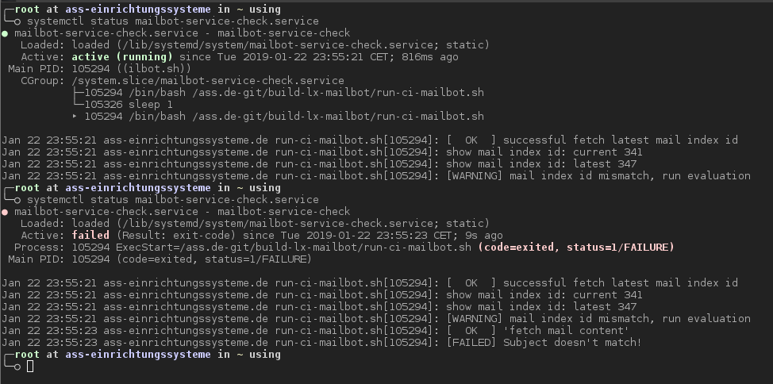
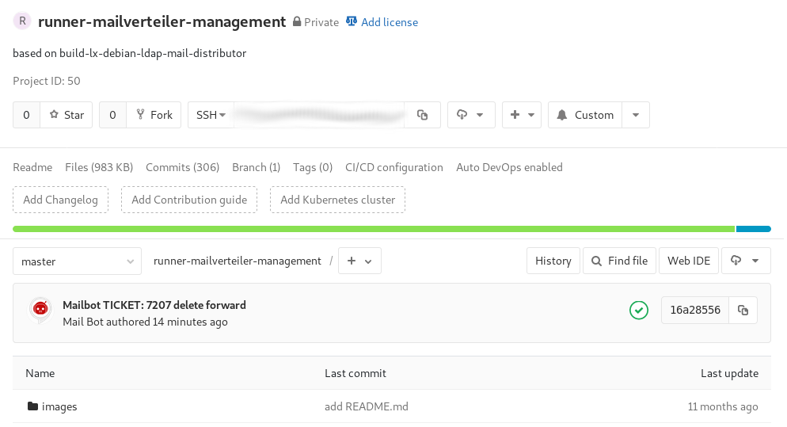
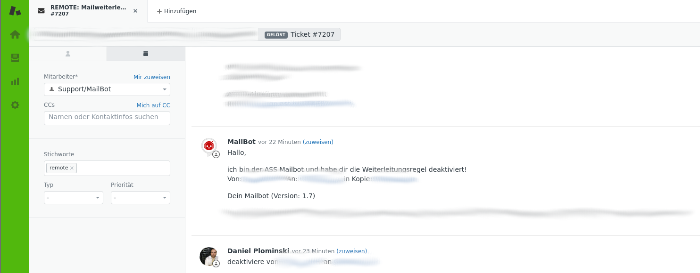

Requirement
===========

```
╭─root at ass-einrichtungssysteme in / using
╰─○ ls -all | grep mailbot
-rw-------   1 root root   444 Jul  7 08:21 id_mailbot_ed25519
-rw-r--r--   1 root root   123 Jul  7 08:21 id_mailbot_ed25519.pub
-rw-------   1 root root    10 Jul  8 05:39 mailbot_ad_pw_credential
-rw-------   1 root root    35 Jul  8 05:39 mailbot_ad_user_credential
-rw-------   1 root root   182 Jul  8 13:45 mailbot_answer.txt
-rw-------   1 root root 19248 Jul  8 13:45 mailbot_content
-rw-------   1 root root    96 Jul  8 05:56 mailbot_exclude
-rw-------   1 root root     3 Jul  8 13:45 mailbot_id
-rw-------   1 root root    24 Jul  8 05:39 mailbot_server
╭─root at ass-einrichtungssysteme in / using
╰─○

╭─root at ass-einrichtungssysteme in / using
╰─○ ls -all /ass.de-git
insgesamt 6
drwxr-xr-x  4 root root  4 Jul  8 02:55 .
drwxr-xr-x 26 root root 35 Jul  8 13:22 ..
drwxr-xr-x  3 root root  5 Jul  8 13:37 build-lx-mailbot
drwxr-xr-x  4 root root 12 Jul  8 13:45 runner-mailverteiler-management
╭─root at ass-einrichtungssysteme in / using
╰─○

╭─root at ass-einrichtungssysteme in / using
╰─○ cat /etc/hostname
ass-einrichtungssysteme.de
╭─root at ass-einrichtungssysteme in / using
╰─○

╭─root at ass-einrichtungssysteme in / using
╰─○ cat /etc/aliases
# See man 5 aliases for format
postmaster:    root
root: mailbot@ass-einrichtungssysteme.de
╭─root at ass-einrichtungssysteme in / using
╰─○

╭─root at ass-einrichtungssysteme in / using
╰─○ cat /lib/systemd/system/mailbot-service-check.service
[Unit]
Description=mailbot-service-check

[Service]
Type=simple
ExecStart=/ass.de-git/build-lx-mailbot/run-ci-mailbot.sh

# EOF
╭─root at ass-einrichtungssysteme in / using
╰─○

╭─root at ass-einrichtungssysteme in / using
╰─○ cat /lib/systemd/system/mailbot-service-check.timer
[Unit]
Description=mailbot-service-check

[Timer]
OnBootSec=0min
OnCalendar=*:0/1
Unit=mailbot-service-check.service

[Install]
WantedBy=multi-user.target

# EOF
╭─root at ass-einrichtungssysteme in / using
╰─○
```

Example
=======

* Console



* Gitlab-Runner LOG



* Zendesk Ticket



